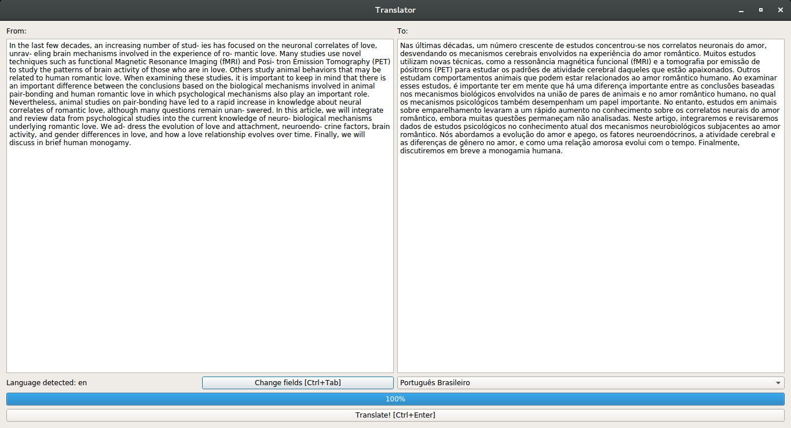

# GUITranslate

This is a GUI for translating text. Especially for texts of scientific papers.



Step by Step to Install:

First of all, have pip and virtualenv installed.

1. Create a virtualenv for the project by prescribing Python 3:<br>
```virtualenv --python = python3 [environment name]```

2. Enter the virtualenv folder and activate it:<br>
```source bin/activate```

3. Make the clone or download the project into the part of the newly created virtualenv, 
create a folder called "app" and put the repository files in it.

4. In the virtualenv root create a "build" folder, download the SIP and PyQt4 modules. Once done, extract them into the folder:<br>
PyQt4: https://www.riverbankcomputing.com/software/pyqt/download<br>
SIP: https://www.riverbankcomputing.com/software/sip/download<br>

5. Install some prerequisites:<br>
```sudo apt-get install python3-dev libxext-dev python-qt4 qt4-dev-tools build-essential```

6. Go to "build/SIP" directory:<br>
```python configure.py``` <br>
```make``` <br>
```sudo make install```

6. Go to "build/PyQt4" directory:<br>
```python configure.py``` <br>
```make``` <br>
```sudo make install```

8. Enter the "app" folder and install pip dependencies:<br>
```pip install -r requirements.txt```

9. Still in the app folder run ```python view.py```
